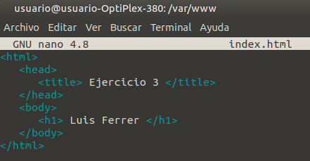

<!-- omit in toc -->
# Examen Primera Evaluación: Ejercicio 2

Luis Ferrer Manero

<!-- omit in toc -->
## Índice

- [Introducción](#introducción)
- [Primeros pasos](#primeros-pasos)
- [Configuración del *VitualHost*](#configuración-del-vitualhost)
- [Resultado](#resultado)

## Introducción

En este ejercicio vamos a crear una página web y un VirtualHost que nos dirija a la web creada mediante la dirección ```www.ejercicio3.daw```

## Primeros pasos

Primero creamos una carpeta para guardar nuestra web dentro del directorio ```/var/www/```:
```
$ cd /var/www/
$ sudo mkdir ejercicio3
```

Y creamos el archivo de nuestra web dentro de la carpeta:
```
$ cd ejercicio3
$ sudo nano index.html
```

Cuyo código tiene este aspecto:  


## Configuración del *VitualHost*

Primero nos dirigimos a la carpeta donde está el archivo de configuración:
```
$ cd /etc/apache2/sites-available/
```
Una vez allí, copiamos el archivo de configuración por defecto de Apache y le cambiamos el nombre:
```
$ sudo cp 000-default.conf ejercicio3.conf
```
Lo abrimos para editarlo:
```
$ sudo nano ejercicio3.conf
```
Y le añadimos la ruta a los archivos de la web local y la url que queremos que tenga:
```
DocumentRoot /var/www/ejercicio3/
ServerName www.ejercicio3.daw
```
También tenemos que modificar el archivo hosts para poder acceder a nuestra página web:
```
$ cd /etc/
$ sudo nano hosts
```
Añadiendo al final del archivo:
```
127.0.0.1 www.ejercicio3.daw
```
Por último, tenemos que activar el archivo de configuración y recargar Apache:
```
$ cd /etc/apache2/sites-available/
$ sudo a2ensite ejercicio3.conf
$ sudo systemctl reload apache2
```

## Resultado

Con esto hecho, si intentamos acceder la url introducida mediante el navegador, podemos ver nuestra página web:  

